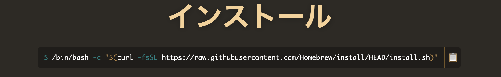
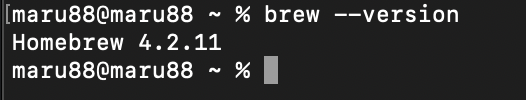

# デザイナー向け Node インストールマニュアル（Mac 版）

## はじめに

このマニュアルは、Mac で Homebrew をインストールするための手順を、デザイナー向けに分かりやすく解説します。<br>
Hmebrew とは、MacOS のツールを管理するためのツールです。これは後述する Node.js などのツールをインストールするのに使用します。
<br>
<br>
<br>

## 0 必要なもの

- ターミナル
  <br>
  <br>
  <br>

## 1 Homebrew のインストール

1. [公式サイト](https://brew.sh/ja/)にアクセスし、下の画像を参考にインストールの文字の下のテキストをコピー
   

<br>

2. ターミナルを開きます。

<br>

3. 以下のコマンドを実行します。

```
/bin/bash -c "$(curl -fsSL https://raw.githubusercontent.com/Homebrew/install/HEAD/install.sh)"
```

<br>

4. コマンドを実行すると以下のメッセージが表示されます。なので自分がいつも PC を立ち上げるときに使用しているパスワードを記述します。<br>
   （パスワードを記入中は、ターミナル画面にはパスワードは表示されません。記入し終わったら、Enter キーを押してください）

```
==> Checking for `sudo` access (which may request your password)...
Password:|
```

<br>

5. Enter キーをクリック後、以下のテキストが表示されるので、こちらも Enter キーをクリックしてください。

```
Press RETURN/ENTER to continue or any other key to abort:
```

<br>

6. これで、インストールが完了です。
   <br>
   <br>
   <br>

## 2 環境変数のパスを通す

次に、環境変数のパスを通す必要があります。これは、どのディレクトリにいても<b>brew</b>という名前を持つコマンドを実行するためです。
<br>
<br>

1. 以下のコマンドを実行します。その時、末尾にある<b>xxx</b>の部分は自分の PC の名前を入れてください。<br>自分の PC の名前がわからない場合は、以下の URL を参考にしてください。

```
echo 'eval "$(/opt/homebrew/bin/brew shellenv)"' >> /Users/xxx/.zprofile
```

※PC の名前がわからない場合の[参考](https://pc-karuma.net/mac-computer-name/)

<br>

2. 上のコマンドを実行後、最後に下記のコマンドをコピペして実行してください。

```
eval "$(/opt/homebrew/bin/brew shellenv)"
```

<br>

3. コマンドを実行すると、環境変数のパスを通すことができます。最後にパスが通ったことを確認するために、以下のコマンドを実行します。

```
brew --version
```

実行すると以下の画像のように表示されます。



<br>
<br>
<br>

## 3 ツールのインストール

次に先ほどインストールした Homebrew を使用して、コーダーがよく使用している【Git】と【Node.js】をインストールします。
そちらの解説は、2 ページに分けて説明します。

<br>

1. [Git のインストール](./2_git_install_mac.md)
2. [Node.js のインストール](./3_node_manual_mac.md)

